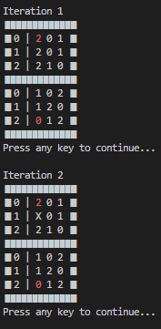
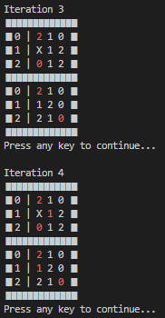
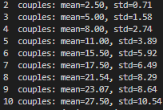

# Stable-Matching-Marriage-Problem
Implementation of the Gale-Shapley algorithm in Python with some visualization and statistics. The algorithm is a perfect stable algorithm which terminates in finite time

---
# Problem Statement
Quoting directly from [wikipedia](https://en.wikipedia.org/wiki/Stable_marriage_problem):
> Given n men and n women, where each person has ranked all members of the opposite sex in order of preference, marry the men and women together such that there are no two people of opposite sex who would both rather have each other than their current partners. When there are no such pairs of people, the set of marriages is deemed stable.

# Suggested Solution
The algorithm suggested is the [Gale-Shapley algorithm](https://en.wikipedia.org/wiki/Gale%E2%80%93Shapley_algorithm).
The algorithm works as shown below:
  
  Input: Preferences Lists of n Men and n Women
  
  Initialize each person to be free.
  while (some man is free and hasn't proposed to every woman) {
    Choose such a man m
    w = 1st woman on m's list to whom m has not yet proposed
    if (w is free)
      m and w become engaged
    else if (w prefers m to her fiancé m')
      m and w become engaged
      m’ becomes free
    else
      w rejects m /* m remains free*/
  }
---

# Implementation

The script can be run directly without need for any dependencies.
There are variables that can be changed for observing the different outcomes of the algorithm. The script by default allows for testing multiple population sizes while also doing monte carlo simulations for experimentally measuring some relevant data such as the number of iterations until termination.

`min_n` and `max_n`: Refers to the minimum and maximum population size. Set both to the same value to test one population size at a time.
`monte_carlo`: number of simulations/instances per run. Set this to 1 to see only one possible initial condition being run.

`plot_statistics`: Determines whether plot_2d and plot_3d function. DEPENDENCIES REQUIRED: `matplotlib` and `numpy`.
`plot_2d`: Plots `Number of iterations` vs `Iteration Distribution` for each population size.

`plot_3d`: Plots `Number of iterations` vs `Iteration Distribution` for each population size (better for large range of population size).

`visualize_iterations`: Visualizes matched men and women as well as their preferences in a table-like format in the console/terminal. Allows the user to go through each iteration step by step and see how the algorithm is working.

`print_statistics`: Prints the mean and standard deviation of the number of iterations until termination for all simulated scenarios for each population size.

---
Finally, I played around with looking at timing and visualizing iteration distributions. Here are some figures I simulated for large population sizes:

